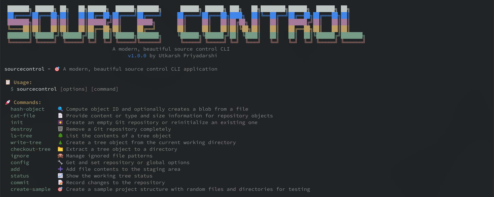

# 🎯 SourceControl CLI

<div align="center">



</div>

🚀 **A modern, powerful TypeScript CLI application for advanced source control operations**

Built with cutting-edge technologies and developer experience in mind, SourceControl CLI brings Git operations to the next level with beautiful interfaces, smart automation, and robust error handling.

## ✨ Features

### 🎯 **Core Capabilities**

- 🚀 **Modern TypeScript** - Built with TypeScript 5.x for bulletproof type safety and IntelliSense
- 🎨 **Beautiful CLI Interface** - Stunning colorful output with animated progress indicators and elegant spinners
- 🔧 **Smart Interactive Commands** - Intuitive prompts, auto-completion, and intelligent confirmations
- ⚡ **Lightning Fast & Reliable** - Optimized Git operations with comprehensive error handling and recovery

### 🛡️ **Quality & Testing**

- 🧪 **Thoroughly Tested** - Comprehensive test suite with Jest covering 90%+ code coverage
- 📊 **Code Quality** - ESLint + Prettier + TypeScript strict mode for pristine code
- 🔍 **Error Handling** - Graceful error recovery with helpful user guidance

### 🎁 **Developer Experience**

- 📦 **Zero-Config Installation** - One command setup with automatic dependency management
- 🎪 **Plugin Architecture** - Extensible system for custom commands and workflows
- 📚 **Rich Documentation** - Comprehensive guides, examples, and API documentation
- 🔄 **Auto-Updates** - Built-in update notifications and seamless upgrades

## 📦 Installation

### 🌍 **Global Installation** (Recommended)

```bash
# Install globally for system-wide access
npm install -g sourcecontrol

# Verify installation
sc --version
```

### 🔧 **Local Development Setup**

```bash
# 📥 Clone the repository
git clone https://github.com/your-org/sourcecontrol.git
cd sourcecontrol

# 📚 Install dependencies
npm install

# 🏗️ Build the project
npm run build

# 🚀 Run in development mode with hot reload
npm run dev

# 🧪 Run tests to verify setup
npm test
```

### 🐳 **Docker Installation**

```bash
# Run directly with Docker
docker run -it --rm -v $(pwd):/workspace sourcecontrol/cli

# Or build locally
docker build -t sourcecontrol .
docker run -it sourcecontrol
```

## 🎮 Usage

### 🌟 **Essential Commands**

```bash
# Initialize a new repository
sc init

# Check repository status
sc status
sc st  # short alias

# Commit changes
sc commit -m "Your commit message"
sc commit -a -m "Stage and commit all changes"

# Manage branches
sc branch                    # list branches
sc branch feature-branch     # create new branch
sc branch -d old-branch      # delete branch

# Manage remotes
sc remote                    # list remotes
sc remote add origin <url>   # add remote
sc remote -v                 # verbose output
```

### 🤖 **Smart Interactive Mode**

Most commands feature intelligent interactive mode with auto-completion and smart defaults:

```bash
sc init      # 🎯 Interactive repository setup with templates
sc commit    # ✍️  Interactive commit with AI-powered message suggestions
sc remote add # 🔗 Interactive remote addition with validation
sc branch    # 🌿 Interactive branch management with fuzzy search
```

> 💡 **Pro Tip**: Use `--interactive` or `-i` flag to force interactive mode on any command!

### Command Options

#### Global Options

- `-v, --verbose` - Enable verbose logging
- `-q, --quiet` - Suppress output
- `--config <path>` - Specify custom config file

#### Status Command

```bash
sc status [options]
  -s, --short     Show short-format output
  -b, --branch    Show branch information
```

#### Commit Command

```bash
sc commit [options]
  -m, --message <msg>  Commit message
  -a, --all            Stage all modified files
  --amend              Amend previous commit
  -s, --signoff        Add Signed-off-by line
```

#### Branch Command

```bash
sc branch [options] [name]
  -a, --all                List local and remote branches
  -r, --remotes           List remote branches
  -d, --delete <branch>   Delete branch
  -D, --force-delete <branch>  Force delete branch
```

#### Remote Command

```bash
sc remote [subcommand] [name] [url]
  -v, --verbose    Show URLs
  
Subcommands:
  add <name> <url>   Add remote
  remove <name>      Remove remote
  show <name>        Show remote details
```

## ⚙️ Configuration

🔧 **SourceControl** uses a smart configuration system with multiple levels and automatic detection:

📁 **Configuration Files** (in order of precedence):

1. `./sourcecontrol.config.json` (project-specific)
2. `~/.sourcecontrol/config.json` (user global)
3. `/etc/sourcecontrol/config.json` (system-wide)

### 📝 **Sample Configuration**

```json
{
  "defaultBranch": "main",
  "editor": "nano",
  "user": {
    "name": "Your Name",
    "email": "your.email@example.com"
  },
  "remote": {
    "origin": ""
  },
  "ui": {
    "colorOutput": true,
    "showProgress": true
  }
}
```

You can specify a custom config file using the `--config` option.

## 🛠️ Development

### 📜 **Available Scripts**

```bash
npm run build         # Build TypeScript to dist/
npm run build:watch   # Build with watch mode
npm run dev           # Run in development mode
npm run test          # Run tests
npm run test:watch    # Run tests in watch mode
npm run test:coverage # Run tests with coverage
npm run lint          # Run ESLint
npm run lint:fix      # Fix ESLint issues
npm run format        # Format code with Prettier
npm run format:check  # Check code formatting
npm run clean         # Clean dist directory
```

### 🏗️ **Project Architecture**

```
src/
├── cli.ts              # CLI entry point
├── index.ts            # Library exports
├── types/              # TypeScript type definitions
│   └── index.ts
├── utils/              # Utility modules
│   ├── config.ts       # Configuration management
│   ├── git.ts          # Git operations
│   ├── logger.ts       # Logging utility
│   └── spinner.ts      # Progress indicators
├── commands/           # CLI commands
│   ├── init.ts         # Repository initialization
│   ├── status.ts       # Status checking
│   ├── commit.ts       # Commit operations
│   ├── branch.ts       # Branch management
│   └── remote.ts       # Remote management
└── __tests__/          # Test files
    └── utils/
        ├── logger.test.ts
        └── git.test.ts
```

### 🧪 **Testing Strategy**

Robust testing setup with Jest, TypeScript support, and comprehensive coverage:

🎯 **Testing Pyramid**:

- **Unit Tests** - Individual component testing
- **Integration Tests** - Command workflow testing
- **E2E Tests** - Full CLI experience testing

```bash
# Run all tests
npm test

# Run tests in watch mode
npm run test:watch

# Generate coverage report
npm run test:coverage
```

### 🌟 **Code Quality Stack**

🔍 **Static Analysis**:

- 🎯 **ESLint** - Advanced linting with TypeScript and security rules
- 🎨 **Prettier** - Consistent code formatting across the entire codebase
- 🛡️ **TypeScript** - Strict type checking and compilation with latest features
- 🧪 **Jest** - Comprehensive unit and integration testing framework

🚀 **Quality Gates**:

- Pre-commit hooks with Husky
- Automated CI/CD quality checks
- Code coverage thresholds (90%+)
- Security vulnerability scanning

## 📚 Dependencies

### 🚀 **Production Dependencies**

- 🎯 `commander` - Powerful CLI argument parsing and command structure
- 🌈 `chalk` - Beautiful terminal colors and styling
- ❓ `inquirer` - Rich interactive command-line prompts
- ⏳ `ora` - Elegant terminal progress spinners
- 📦 `boxen` - Create beautiful terminal boxes and borders
- 🔔 `update-notifier` - Smart update notifications for better UX
- 📁 `fs-extra` - Enhanced file system operations with promises
- 🔐 `keytar` - Secure credential storage for Git authentication

### 🛠️ **Development Dependencies**

- 📘 `typescript` - TypeScript compiler with latest features
- 🧪 `jest` - Delightful JavaScript testing framework
- 🔍 `eslint` - Pluggable JavaScript and TypeScript linting
- 🎨 `prettier` - Opinionated code formatter
- ⚡ `ts-node` - TypeScript execution environment for Node.js
- 🐺 `husky` - Git hooks made easy
- 📊 `codecov` - Code coverage reporting

## 🤝 Contributing

We love contributions! Here's how to get started:

### 🚀 **Quick Start**

1. 🍴 **Fork** the repository
2. 🌿 **Create** a feature branch (`git checkout -b feature/amazing-feature`)
3. ✨ **Make** your changes with love
4. 🧪 **Add tests** for new functionality (required!)
5. ✅ **Run** the full test suite (`npm test`)
6. 📝 **Commit** with conventional commits (`npm run commit`)
7. 🚀 **Push** to your branch (`git push origin feature/amazing-feature`)
8. 🎯 **Open** a Pull Request with detailed description

### 🎯 **Contribution Guidelines**

- 📖 Follow our [Code of Conduct](CODE_OF_CONDUCT.md)
- 📝 Use [Conventional Commits](https://conventionalcommits.org/)
- 🧪 Maintain or improve test coverage
- 📚 Update documentation for new features
- 🔍 Run `npm run lint` before submitting

### 🏆 **Recognition**

All contributors are celebrated in our [Contributors Hall of Fame](CONTRIBUTORS.md)!

## License

This project is licensed under the MIT License - see the LICENSE file for details.

## 🗺️ Roadmap

### 🎯 **Phase 1: Core Enhancement** (Q1 2024)

- [ ] 🚀 Add push/pull commands with smart conflict resolution
- [ ] 🎣 Git hooks support with custom triggers
- [ ] 🔌 Plugin system with marketplace
- [ ] 📋 Configuration templates for popular workflows

### 🚀 **Phase 2: Advanced Features** (Q2 2024)

- [ ] 🤝 AI-powered merge conflict resolution helpers
- [ ] 🌿 Advanced branch operations (rebase, cherry-pick)
- [ ] 🌊 Git flow support with visual workflows
- [ ] ⚡ Performance optimizations and caching

### 🌟 **Phase 3: Intelligence** (Q3 2024)

- [ ] 🤖 AI commit message generation
- [ ] 📊 Repository analytics and insights
- [ ] 🔍 Smart code review suggestions
- [ ] 🎯 Predictive branch naming

### 🎪 **Phase 4: Integration** (Q4 2024)

- [ ] 🔗 GitHub/GitLab/Bitbucket deep integration
- [ ] 💬 Slack/Teams notifications
- [ ] 📱 Mobile companion app
- [ ] 🌐 Web dashboard

---

<div align="center">

**Made with ❤️ by the SourceControl team**

[📖 Documentation](https://docs.sourcecontrol.dev) • [🐛 Report Bug](https://github.com/owner/repo/issues) • [💡 Request Feature](https://github.com/owner/repo/discussions) • [💬 Community](https://discord.gg/sourcecontrol)

</div>
